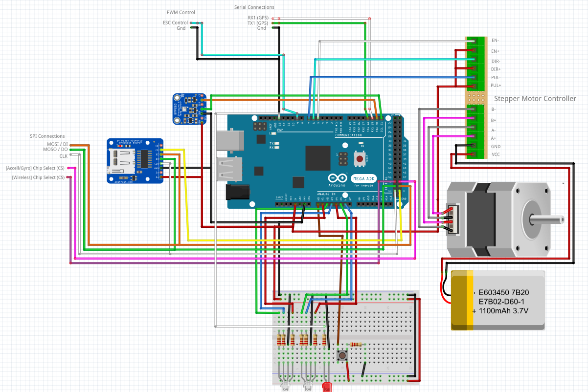

# MARS Control Software

## Warning

> :warning: A good ~~30%~~, ~~50%~~, *large amount* of this documentation is out of date or just wrong..... It's being worked on..... - [Cal]

The code for the MARS payload.  
This Readme _should_ cover everything but if it dosn't then just yell at me... [_Cal_]

## Install

Once you have [cloned](#git) [or downloaded](https://github.com/calw20/MARS/archive/master.zip)  the repo, [setup](#setup) the Arduino making any changes needed and then run the [Upload](Upload.ps1) script. This will download the correct libraries, make sure that the correct header files are created and upload the code to the Arduino.
With some luck everything _should_ just work.

>:notebook_with_decorative_cover: If you try and open [main.ino](main.ino) then the Arduino IDE ~~will~~ _may_ throw a hissy-fit and not want to work with you. Try if you like but it may break....

## Usage

There are _two_ main ways to make the Arduino rotate the filter plate in the sandwich; the Button and _falling **past**_ an Altitude. By default both are enabled, and the specific altitudes that should trigger rotation are defined in [payload_settings.h](payload_settings.h)  under `FILTER_HEIGHTS`. Other settings such as the apogee height can also be found in that file. See [Calibration and Configuration](#Calibration-and-Configuration) for more information.

## Setup

### Calibration and Configuration

For ease of debugging and programming most variable and configuration options needed for deployment are in the [payload_settings.h](payload_settings.h) header file.

#### Operational Parameters

>:warning: Currently if you _enable_ `ROTATE_ON_ALTITUDE` then things **_will_** break.  
>:notebook_with_decorative_cover: Remember once changes have been made to any of the files, you need to _re-upload_ the code to the arduino.

|       Option       |  Possible Values  |Explanation|
|--------------------|-------------------|-|
|`APOGEE_HEIGHT`     |Any `integer`      |In meters, what height should be considered to be the highest point of flight.|
|`FILTER_HEIGHTS`    |Array of `integers`|When descending, at what heights (meters) should the filter plate be rotated. For example if there were _two_ filters and _one_ quarantine blank and the first filter is needed to be rotated into place at 40m, the second is then moved into place at 30 then the quarantine blank is moved back into place at 10m above the ground, then the array would look like this: `{40, 30, 10}`|
|`ROTATE_ON_ALTITUDE`|`true` or `false`  |Should rotation events occur when descending.|
|`ROTATE_ON_BUTTON`  |`true` or `false`  |Should the button trigger a rotation event.|
|`STEPS_PER_ROTATION`|Any `integer`      |How many _stepper motor steps_ will are need to move a filter in position a -> b|

### Wiring Layout

>:notebook_with_decorative_cover: The LED shown to be connected to pin 13 is not _technically_ needed due to it sharing the pin with the inbuilt LED...  
>:notebook_with_decorative_cover: While a MicoSD-Card breakout board is shown in the diagram, any SD compatible board will work. (We use an el-cheapo regular SD-Card breakout board).  
>:closed_book: The pin breakout on each board may differ but commonly `DO = MISO = 50` and `DI = MOSI = 51`

If needed the see the sub-components data sheet for information regarding setup or use.

* [Stepper Motor Controller](https://wiki.dfrobot.com/TB6600_Stepper_Motor_Driver_SKU__DRI0043)
* [BMP280 Pressure Sensor](https://learn.adafruit.com/adafruit-bmp280-barometric-pressure-plus-temperature-sensor-breakout/arduino-test)
* [MPU6050 6-Axis Accelerometer/Gyro ](https://www.dfrobot.com/product-880.html)
* [nRF24L01+ Transceiver](https://www.sparkfun.com/products/691)

>:orange_book: We may want to use [this](https://www.sparkfun.com/products/705) version of the transceiver as it has an RP-SMA 2.4GHz antenna connector on it

>:heavy_exclamation_mark: *Wiring Layout* is out of date. It does not show the MPU6050 or nRF24L01+



### Debugging

> See [Warning]

At compile time, the pre-build ~~python script~~ _"tool chain"_ will auto-magically* create a header file to add in a few useful things, **but** it will also _ENABLE_ the debug logging to the arduino's serial port. By default the serial port speed is `115200` and if you need to change it, then change the `SERIAL_BAUD` option in [main.ino](main.ino) to what ever speed you need.

#### Contributing to the codebase

See the [Contributing](CONTRIBUTING.md) file for info on how to setup the folder and make changes.
>:exclamation: Note: It is assumed you have read the [Git](#git) and [Install Commands](#Install-Commands) sections.

### Git

It is *__HIGHLY__* recommended you use git to clone the repo as code [upload script](Upload.ps1) was built to be able to auto-magically* download the latest version of the code. It would also allow for any changes in code made locally to be uploaded and synced, _potentially*_ making debugging _"easier"_. For more info on how to get git and use git check out the [Git Beginner Tutorial](https://product.hubspot.com/blog/git-and-github-tutorial-for-beginners) done by GitHub.  
<sub><sub>* Due to the fundamental love<->hate relationship we mortals have with the debugging gods, auto-magic systems may not be _cooperative_ at all times.</sub></sub>

#### Install Commands

>:warning: __Important Note:__ Because computers, when you try to launch the upload script it *may* yell at you about  *"Execution Policies"* or *"Unauthorized Access"* errors. This is normal, [TL;DR](https://docs.microsoft.com/en-us/powershell/module/microsoft.powershell.core/about/about_execution_policies?view=powershell-7) its for security. If this does occur you need to open `powershell` as an administrator (search for it in the start-menu, then right click) and then run this `Set-ExecutionPolicy RemoteSigned`  command (or equivalent)  to allow scripts to be executed. Then you should be good to go!

```dos
git clone https://github.com/calw20/MARS-Prototype.git
cd MARS-Prototype
Upload.ps1
```
